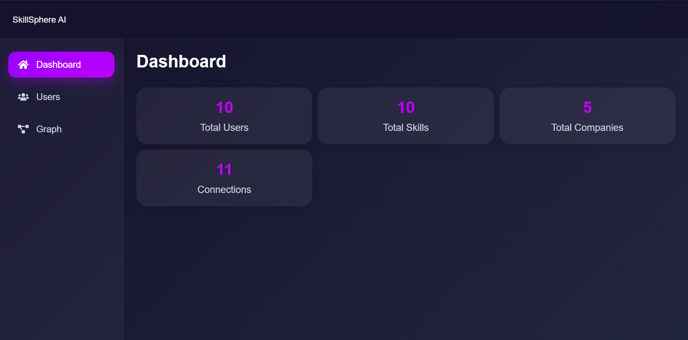
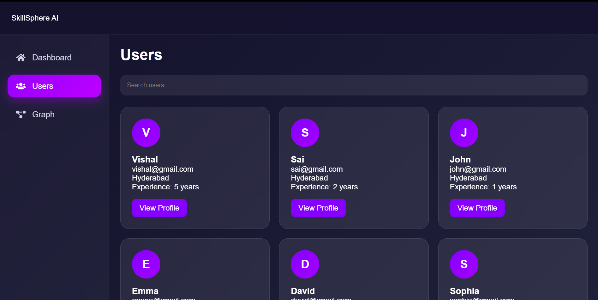
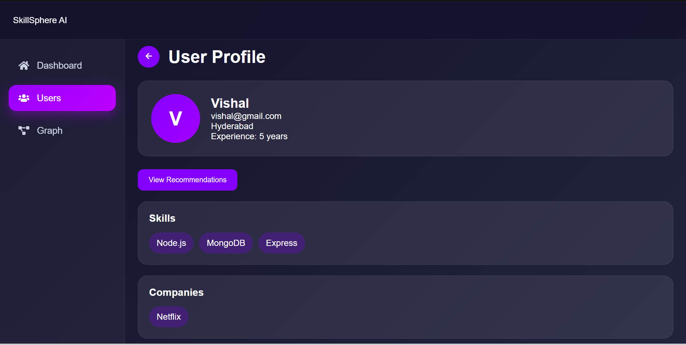
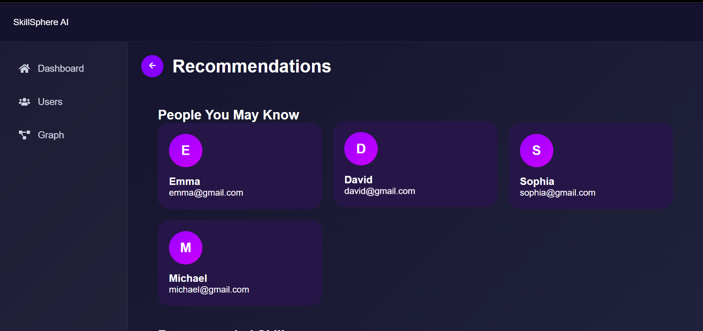
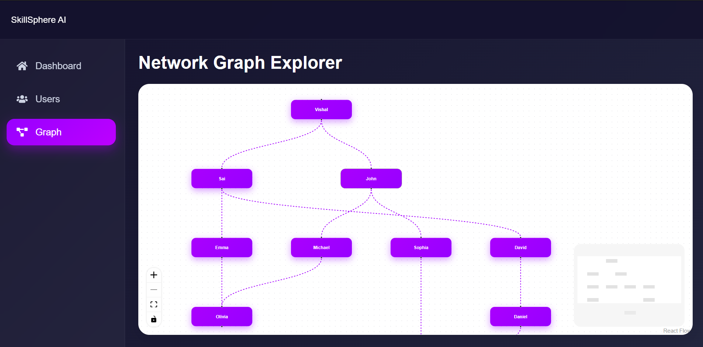

# SkillSphere AI

A graph-powered professional networking and skill intelligence platform built using React.js, Node.js, Express.js, and CognoDB (Neo4j-compatible Graph Database).

The application demonstrates how graph databases efficiently model relationships between users, skills, companies, and professional connections to provide meaningful recommendations and insights.

---

# Live Demo

### Frontend
https://skill-sphere-ai-self.vercel.app/
---

# Why a Graph Database?

Traditional relational databases are excellent for tabular data but become increasingly complex when querying deeply connected information.

SkillSphere AI revolves around relationships:

- Users connect with other users
- Users possess skills
- Companies look for skills
- Recommendations are generated through multiple relationship hops

Using a graph database allows us to:

- Traverse connections efficiently
- Execute multi-hop queries naturally
- Discover hidden relationships
- Build recommendation systems with minimal query complexity

Example:

```cypher
MATCH (u:User {id:$userId})
-[:CONNECTED_TO]->
(friend)
-[:CONNECTED_TO]->
(recommended)

WHERE recommended <> u

RETURN DISTINCT recommended
```

This query would require multiple joins in a relational database but is straightforward in a graph database.

---

# Use Case

SkillSphere AI helps professionals:

- Explore their professional network
- Discover new connections
- Find relevant skills to learn
- Identify companies hiring for their skill set
- Visualize professional relationships using an interactive graph

---

# Features

## Dashboard

- Total Users
- Total Skills
- Total Companies
- Total Connections

## Users

- Browse all users
- View profile details
- Explore skills
- View company associations
- View network connections

## Recommendations

- People You May Know
- Recommended Skills
- Companies Hiring Your Skills

## Graph Explorer

- Interactive network visualization
- User relationship mapping
- Automatic graph layout using Dagre
- Zoom and pan support

## Error Handling

- API error states
- Database connection failure handling
- Empty states
- Loading states

## Responsive Design

- Desktop layout
- Tablet support
- Mobile bottom navigation

---

# Future Improvements

The current implementation focuses on the core graph-based use case required for the assignment. The following improvements would be considered for a production-ready version:

## Performance & Scalability

- **Pagination** for the Users and other potentially large result sets instead of loading all records at once.
- **Debounced search** for user search to avoid sending an API request for every keystroke.
- **Query optimization** and appropriate graph indexing/constraints as the dataset grows.
- **Lazy loading** for larger graph visualizations and heavier UI sections.
- **API response caching** for frequently requested recommendation and dashboard data.
- **Connection pooling and query reuse** to reduce unnecessary database overhead.
- **Graph data limiting/filtering** so the Graph Explorer does not attempt to render the entire graph for larger datasets.

## Search & Discovery

- Advanced search by name, location, experience, skill, and company.
- Search suggestions and autocomplete.
- Filtering and sorting users by relevant attributes.
- Graph search that highlights matching users and their connected relationships.

## Recommendation Engine

- Recommendation scoring instead of simple relationship-based matching.
- Explainable recommendations, such as:
  - "Recommended because you share 2 skills."
  - "Recommended because you are connected through John."
  - "Recommended because the company is looking for Node.js."
- Skill-gap analysis based on a user's existing skills.
- Company ranking based on skill relevance.
- Personalized career and learning recommendations.

## Graph Explorer

- Filter graph nodes by type.
- Search and highlight nodes.
- Interactive node detail panel.
- Click a graph node to navigate directly to its profile.
- Relationship labels and relationship-type filtering.
- Cluster visualization for larger networks.
- Expand/collapse graph relationships dynamically.
- Improved graph layouts for large datasets.

## Application Features

- Authentication and authorization.
- User profile editing.
- Ability to add or remove professional connections.
- Ability to add and manage skills.
- Company and job posting management.
- Saved recommendations.
- Notifications for relevant connections and opportunities.

## Reliability & Monitoring

- Centralized API error handling.
- Structured backend logging.
- Request tracing and monitoring.
- Health-check endpoints for the backend and CognoDB connection.
- Automated tests for services, controllers, and critical Cypher queries.
- CI/CD pipeline with automated linting, testing, and production builds.

## Production Enhancements

- Rate limiting and request throttling.
- Input validation and sanitization.
- Secure authentication and session management.
- Environment-specific configurations.
- Database backup and recovery strategy.
- Monitoring of graph query performance and database resource usage.

---

# Tech Stack

## Frontend

- React.js
- React Router
- Axios
- React Flow
- Dagre
- React Icons
- CSS3

## Backend

- Node.js
- Express.js
- Neo4j Driver

## Database

- CognoDB Cloud
- OpenCypher
- Bolt Protocol

## Deployment

- Vercel (Frontend)
- Render (Backend)

---

# Graph Data Model

```text
(User)
   |
   | HAS_SKILL
   v
(Skill)

(User)
   |
   | CONNECTED_TO
   v
(User)

(Company)
   |
   | LOOKING_FOR
   v
(Skill)
```

---

# Example Data Model

## User

```json
{
  "id": "uuid",
  "name": "Vishal",
  "email": "vishal@example.com"
}
```

## Skill

```json
{
  "id": "uuid",
  "name": "Node.js"
}
```

## Company

```json
{
  "id": "uuid",
  "name": "OpenAI"
}
```

---

# Main Graph Queries

## 1. User Connections

```cypher
MATCH (u:User)-[:CONNECTED_TO]->(friend)
RETURN u, friend
```

Purpose:

- Discover direct professional connections

---

## 2. Multi-Hop Recommendation Query

```cypher
MATCH (u:User {id:$userId})
-[:CONNECTED_TO]->
(friend)
-[:CONNECTED_TO]->
(recommended)

WHERE recommended <> u

RETURN DISTINCT recommended
```

Purpose:

- Suggest second-degree connections

---

## 3. Skill Recommendation Query

```cypher
MATCH (u:User {id:$userId})
-[:HAS_SKILL]->
(skill)
-[:RELATED_TO]->
(recommended)

RETURN DISTINCT recommended
```

Purpose:

- Recommend relevant skills

---

## 4. Company Recommendation Query

```cypher
MATCH (u:User {id:$userId})
-[:HAS_SKILL]->
(skill)
<-[:LOOKING_FOR]-
(company)

RETURN DISTINCT company
```

Purpose:

- Find companies hiring for a user's skills

---

# Project Structure

```bash
skill-sphere-ai
│
├── frontend
│   ├── src
│   │   ├── components
│   │   ├── pages
│   │   ├── services
│   │   ├── layouts
│   │   └── routes
│   │
│   └── public
│
├── backend
│   ├── src
│   │   ├── config
│   │   ├── controllers
│   │   ├── routes
│   │   ├── services
│   │   ├── scripts
│   │   └── queries
│
└── README.md
```

---

# CognoDB Setup

## Create Account

https://console.cognodb.com/signup

## Create Database

1. Create a free instance
2. Choose a region
3. Save:

- Bolt URI
- Username
- Password

## Install Driver

```bash
npm install neo4j-driver
```

---

# Environment Variables

## Backend

Create:

```bash
backend/.env
```

```env
PORT=5000

DB_URI=bolt+s://your-instance.databases.cognodb.cloud
DB_USERNAME=cognodb
DB_PASSWORD=your_password
```

## Frontend

Create:

```bash
frontend/.env
```

```env
REACT_APP_API_URL=http://localhost:5000/api
```

---

# Installation

## Clone Repository

```bash
git clone https://github.com/vishalinkollu/skill-sphere-ai
```

## Backend

```bash
cd backend

npm install

npm run dev
```

## Frontend

```bash
cd frontend

npm install

npm start
```

---

# Seed Data

Run the seed script:

```bash
node src/scripts/seedGraph.js
```

This creates:

- Users
- Skills
- Companies
- Connections
- Skill relationships

---

# Screenshots

## Dashboard



## Users



## User Profile



## Recommendations



## Graph Explorer



---

# Design Decisions

## Why React?

- Fast development
- Component reusability
- Rich ecosystem

## Why Express?

- Lightweight
- Easy API development
- Excellent Neo4j integration

## Why React Flow?

- Interactive graph visualization
- Easy customization
- Production-ready graph UI

## Why Dagre?

- Automatic graph layout
- Prevents node overlap
- Improves readability

---

# Error Handling

Implemented:

- Database unavailable state
- API failure state
- Empty recommendation state
- Loading states
- Graceful UI fallbacks

---


# Author

**Vishal Inkollu**

Software Engineer

GitHub:
https://github.com/vishalinkollu


---
